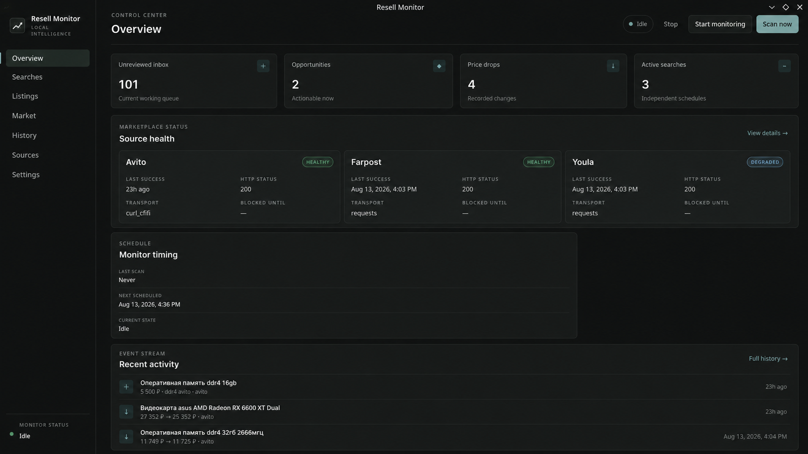
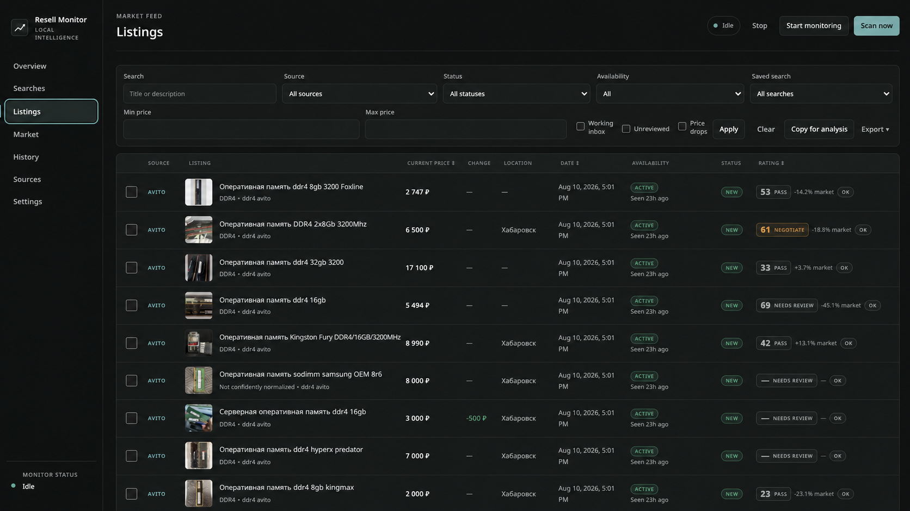
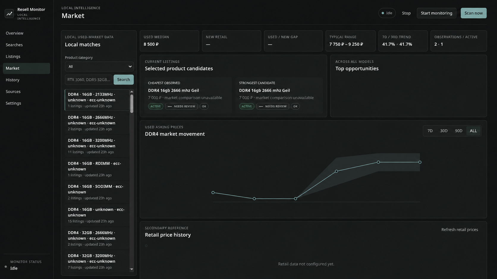
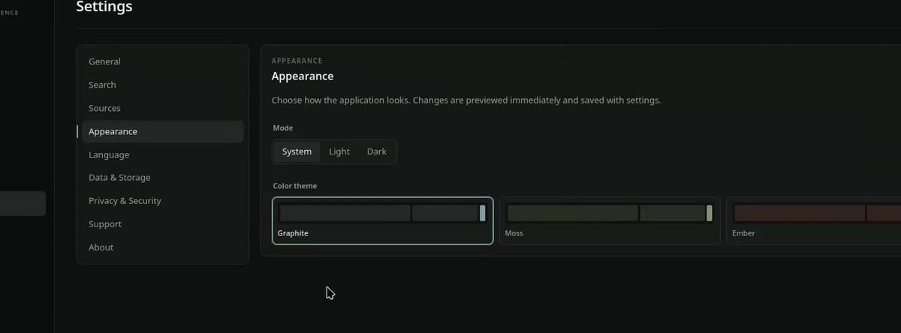
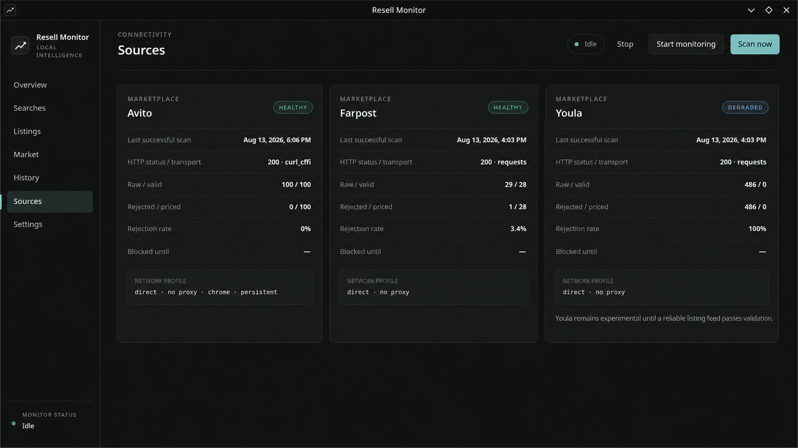

<p align="center">
  
</p>

<h1 align="center">Resell Monitor</h1>

<p align="center">
  Local-first desktop marketplace monitoring and deterministic deal analysis for PC-component resale research.
</p>

<p align="center">
  <a href="CHANGELOG.md"></a>
  <a href="#installation"></a>
  <a href="#installation"></a>
  <a href="#development"></a>
  <a href="LICENSE"></a>
</p>

<p align="center"><strong>First public Alpha · Linux x86_64</strong></p>

<p align="center">
  
</p>

Resell Monitor brings saved searches, normalized marketplace listings, price
history, and transparent rule-based analysis into one quiet desktop workspace.
It is designed around Khabarovsk today, stores mutable data outside the
application, and leaves the final buying decision to the user. It does not use
AI for valuation or automate purchases or seller contact.

The Overview keeps the working state visible at a glance: inbox volume,
opportunities, price drops, active searches, source health, monitoring schedule,
and recent activity.

## What Resell Monitor does

- Monitors saved searches across independently configured marketplace sources.
- Normalizes results into a shared listing workspace with thumbnails, filters,
  availability, lifecycle status, location, dates, and price changes.
- Ranks candidates with deterministic signals, review reasons, and comparable
  used-market evidence rather than opaque predictions.
- Preserves duplicate, price, availability, first-seen, and last-seen history in
  a local SQLite database.
- Exposes source health and validation details instead of hiding degraded access.
- Supports TXT, JSON, and HTML exports, RU/EN, manual update checking, and Linux
  desktop integration.

## A workspace for real listings

The Listings view is the main review surface: dense enough for comparison while
keeping images, current price, changes, location, date, lifecycle state,
availability, rating, and market context together. Filters and saved-search
scoping help narrow the queue without obscuring why an item needs attention.

<p align="center">
  
</p>

## Market context, not promises

Market views group normalized observations into comparable products and show
used medians, typical ranges, candidate listings, observation counts, and price
movement over time. Evidence can be incomplete when a product is ambiguous or a
source is unavailable; the interface marks missing comparison data rather than
inventing a valuation.

<p align="center">
  
</p>

## Designed for daily use

The interface includes Russian and English translations, System, Light, and
Dark appearance modes, and four restrained color families: Graphite, Moss,
Ember, and Plum.

<p align="center">
  
</p>

## Supported sources

Source adapters are isolated and report their own transport and validation
state. A successful HTTP response does not automatically mean usable listings;
the Sources view distinguishes raw results from validated and priced items.

| Source | Alpha status |
| --- | --- |
| Avito | Primary supported source; ordinary HTTP and embedded frontend data first, with Playwright fallback when required |
| FarPost | Supported with more limited capabilities and image coverage than Avito |
| Youla | Experimental; may remain degraded when no reliable server-side listing feed passes validation |

DNS, Ozon, and Wildberries are experimental retail-comparison providers, not
equivalent marketplace sources. Any marketplace or retail endpoint can change,
block access, or return incomplete evidence.

<p align="center">
  
</p>

Access is intentionally conservative. Resell Monitor does not bypass CAPTCHAs,
rotate proxies automatically, or use stealth and anti-detection libraries.

## Download

Resell Monitor 0.1.0 Alpha is being prepared as a portable AppImage for
**Linux x86_64**. The AppImage and its SHA256 checksum will be available on the
[GitHub Releases page](https://github.com/lawetaq/resell-monitor/releases) when
the first public release is published. Python is not required to run the
packaged application.

## Installation

1. Download the AppImage from GitHub Releases.
2. If needed, open its file properties and enable **Allow executing as program**.
3. Open Resell Monitor. It is fully functional in portable mode.
4. Optionally choose **Add to applications** to add a user-level desktop-menu entry.

The integration action remains available under **Settings → About →
Installation**, requires no `sudo`, and does not move or remove application data.

<details>
<summary>Checksum and terminal fallback</summary>

```bash
sha256sum -c ResellMonitor-0.1.0-x86_64.AppImage.sha256
chmod +x ResellMonitor-0.1.0-x86_64.AppImage
./ResellMonitor-0.1.0-x86_64.AppImage
```

The release bundle also retains `install_linux_user.sh` and
`uninstall_linux_user.sh` as advanced helpers. Removing desktop integration
preserves user data.

</details>

## Quick start

1. Launch Resell Monitor and confirm the default location, or choose another location.
2. Create or enable a saved search for a supported source.
3. Select **Scan now** for an explicit one-time scan.
4. Review new results in **Listings** and update their lifecycle status.
5. Open **Market** to inspect available comparisons and price history.

Launching the application does not start a marketplace scan. Keep the number of
saved searches and their request frequency conservative.

## Updating

There is no automatic update. **Settings → About → Check for updates** contacts
GitHub only when requested and can open a published release page; it never
downloads or installs an update. Portable users can replace the AppImage file.
Integrated users can launch the new AppImage and choose **Reinstall
integration**. User data remains separate in both cases.

## Data and privacy

Listings, searches, settings, history, analytics, exports, and browser-assisted
profiles remain in the user's environment. No telemetry is currently
implemented. Marketplace and configured retail requests originate from that
environment.

Typical packaged Linux locations are:

- Data, database, exports, and backups: `~/.local/share/resell-monitor/`
- Configuration and saved searches: `~/.config/resell-monitor/`
- Cache: `~/.cache/resell-monitor/`
- Logs and source diagnostics: `~/.local/state/resell-monitor/log/`

XDG overrides can change the expanded paths. Replacing the AppImage or removing
desktop integration does not delete these directories. Source mode uses the
repository-local development paths documented in the configuration defaults.

## Known limitations

- This is Alpha software; Linux x86_64 is the first packaged platform and
  external distribution, desktop, and graphics-stack testing is still limited.
- Marketplace access can be blocked or degraded, and source capabilities differ.
- Avito currently has stronger listing-image support than FarPost and Youla.
- Browser-Assisted Retail is experimental and requires deliberate user interaction.
- Some systems may print harmless Qt/Vulkan probing or Qt WebEngine teardown
  warnings even when the application opens and closes normally.
- Windows packaging and automatic updates are not implemented.

Testing feedback is welcome. The [first Alpha tester checklist](docs/TESTING_ALPHA.md)
describes useful checks and environment details without requesting private data.

<details>
<summary>Linux desktop diagnostics</summary>

Qt WebEngine can print `VK_ERROR_INCOMPATIBLE_DRIVER` while probing graphics
backends; if the window renders normally, this is generally a non-fatal
fallback. Some pywebview/Qt combinations also print
`Release of profile requested but WebEnginePage still not deleted` during
teardown. After closing, verify that no process or listener remains:

```bash
pgrep -af 'ResellMonitor|QtWebEngineProcess'
ss -ltnp | grep ResellMonitor
```

</details>

## Development

Requirements: Python 3.13 and a supported Linux development environment.

```bash
python3.13 -m venv .venv
.venv/bin/python -m pip install --upgrade pip
.venv/bin/python -m pip install -r requirements-desktop.txt
cp searches.example.json searches.json
.venv/bin/python -m src.desktop --gui qt
```

The example searches are disabled. Browser development mode is available with
`.venv/bin/python -m src.gui.app --config searches.json`; GTK can be selected
with `python -m src.desktop --gui gtk` when its distribution dependencies are
installed. Browser-Assisted Retail and the Avito Playwright fallback require a
separately installed browser runtime.

Run the offline test suite without marketplace scans:

```bash
.venv/bin/python -m unittest discover -s tests -p 'test_*.py' -v
```

For Linux builds, packaging, artifact validation, and the release checklist, see
[docs/RELEASING.md](docs/RELEASING.md). A safe AppImage smoke-test copy outside
the checkout uses an absolute artifact path:

```bash
artifact="$(pwd)/dist/ResellMonitor-0.1.0-x86_64.AppImage"
cp "$artifact" /tmp/ResellMonitor-0.1.0-x86_64.AppImage
cd /tmp
./ResellMonitor-0.1.0-x86_64.AppImage
```

## Roadmap

- Windows distribution after the Linux release path is validated.
- Marketplace source reliability and capability improvements.
- Richer listing image and gallery support.
- Notifications and broader Linux compatibility validation.
- Security hardening and release automation after the manual pipeline is proven.

Roadmap items have no promised dates and follow tested product needs.

## License

Resell Monitor is available under the [MIT License](LICENSE).
